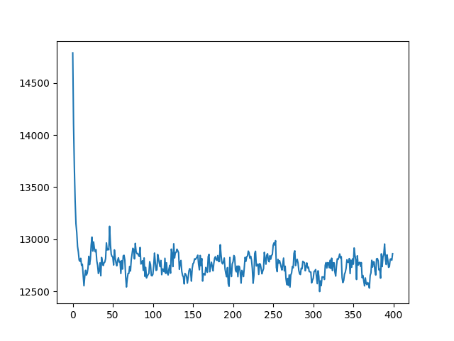
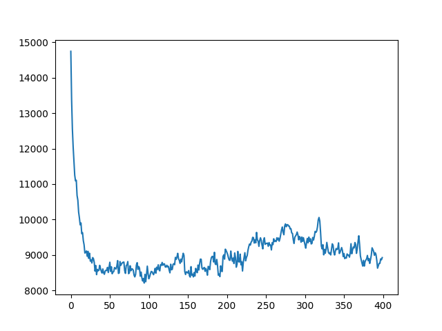

# GA TSP

The route for these tests was:
```python
route = [City(872, 685),City(583, 627),City(934, 844),City(523, 760),City(995, 292),City(57, 889),City(820, 84),City(14, 743),City(845, 637),City(828, 165),City(203, 98),City(546, 761),City(108, 238),City(966, 643),City(808, 636),City(701, 639),City(704, 200),City(529, 517),City(909, 45),City(613, 538),City(154, 381),City(506, 926),City(79, 340),City(525, 215),City(132, 138)]

class City:
    def __init__(self, x, y):
        self.x = x
        self.y = y
```

## Test 0


* `elitism_count` was 1
* `parent_pick_type` was `random`
* `population_size` was 250
* `mutation_rate` was 0.1
It ran for 400 generations.

## Test 1


* `elitism_count` was 30
* `parent_pick_type` was `random`
* `population_size` was 250
* `mutation_rate` was 0.1
It ran for 400 generations.

## Test 2


* `elitism_count` was 30
* `parent_pick_type` was `tournament` (tournament size was 8)
* `population_size` was 250
* `mutation_rate` was 0.1
It ran for 400 generations.

## Test 3


* `elitism_count` was 1
* `parent_pick_type` was `tournament` (tournament size was 168)
* `population_size` was 250
* `mutation_rate` was 0.1
It ran for 400 generations.

## Test 4


* `elitism_count` was 30
* `parent_pick_type` was `tournament` (tournament size was 16)
* `population_size` was 250
* `mutation_rate` was 0.1
It ran for 400 generations.
